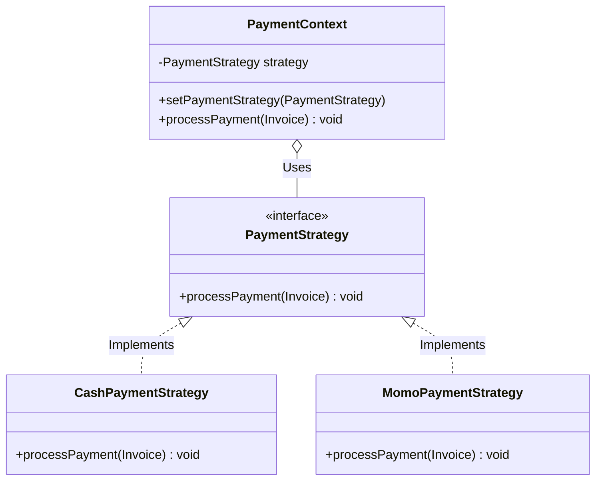
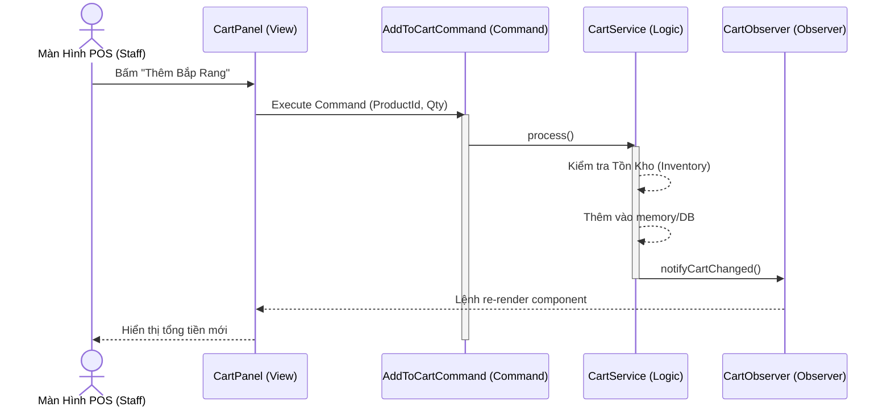
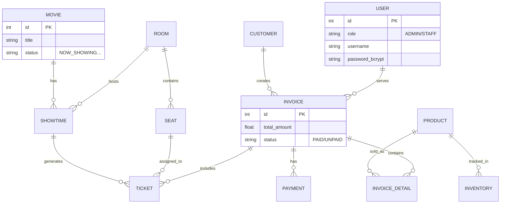

<div align="center">


# 🎬 F3 CINEMA MANAGEMENT SYSTEM

**Hệ sinh thái Quản lý Rạp chiếu phim Toàn diện & Hiện đại**

<p align="center">
  
  
  
  
  
</p>

</div>

---

<details open>
  <summary><b>📑 MỤC LỤC CHI TIẾT (Bấm để mở rộng)</b></summary>
  <ol>
    <li><a href="#1-tổng-quan-hệ-thống-">Tổng Quan Hệ Thống</a></li>
    <li><a href="#2-kiến-trúc-phần-mềm--uml-diagrams-">Kiến Trúc Phần Mềm & UML</a>
      <ul>
        <li><a href="#a-sơ-đồ-lớp-class-diagram---thanh-toán-strategy">Strategy Pattern (Thanh Toán)</a></li>
        <li><a href="#b-sơ-đồ-luồng-sequence-diagram---hệ-giỏ-hàng-command--observer">Command & Observer (Giỏ Hàng)</a></li>
      </ul>
    </li>
    <li><a href="#3-sơ-đồ-cơ-sở-dữ-liệu-erd-">Sơ Đồ ERD (Entity Relationship)</a></li>
    <li><a href="#4-tính-năng-chi-tiết-">Tính Năng Chi Tiết</a></li>
    <li><a href="#5-hướng-dẫn-triển-khai-">Hướng Dẫn Triển Khai</a></li>
  </ol>
</details>

---

## 1. Tổng Quan Hệ Thống 🌟

**F3 Cinema** là một ứng dụng Desktop mạnh mẽ được phát triển bằng **Java 21**. Trái ngược với các ứng dụng Swing truyền thống cũ kỹ, F3 Cinema sử dụng **FlatLaf (Modern Midnight Theme)** đem lại một giao diện Dark-mode cao cấp, mang trải nghiệm UI/UX tiệm cận với các Web App hiện đại.

Hệ thống số hóa toàn bộ chuỗi quy trình vận hành rạp chiếu phim từ khâu: **Nhập kho ➔ Lập lịch chiếu ➔ Bán vé/Đồ ăn (POS) ➔ Thanh toán ➔ Báo cáo doanh thu.**

---

## 2. Kiến Trúc Phần Mềm & UML Diagrams 📐

Dự án áp dụng chặt chẽ các mẫu thiết kế (Design Patterns) tiêu chuẩn của GOF, đảm bảo tính mở rộng linh hoạt cao (SOLID Principles).

### A. Sơ đồ Lớp (Class Diagram) - Thanh Toán (Strategy)
Hệ thống thanh toán được cô lập hoàn toàn khỏi logic UI. Cấu trúc này cho phép thêm cổng thanh toán ZaloPay/Visa cực kỳ dễ dàng mà không cần sửa code cũ.



### B. Sơ đồ Luồng (Sequence Diagram) - Hệ Giỏ Hàng (Command & Observer)
Mô phỏng luồng Staff nhấn thêm "Bắp rang bơ" vào giỏ hàng. UI không tự tính toán mà đẩy `AddToCartCommand` vào luồng xử lý. Sau đó `CartObserver` sẽ nhận tín hiệu để cập nhật màn hình ngay lập tức.



---

## 3. Sơ Đồ Cơ Sở Dữ Liệu (ERD) 🗄️

Cơ sở dữ liệu được thiết kế tối ưu Query, đạt chuẩn dạng chuẩn 3 (3NF) với Hibernate ORM tự động map các Entity.



---

## 4. Tính Năng Chi Tiết 🚀

| Phân Hệ | Nhóm Tính Năng | Mô Tả Nghiệp Vụ |
| :--- | :--- | :--- |
| 🛡 **Admin** | 🎬 **Quản lý Phim** | CRUD phim, phân loại, gán nhãn trạng thái (Sắp chiếu, Đang chiếu, Ngừng chiếu). |
| | 🏢 **Phòng & Ghế** | Vẽ sơ đồ phòng chiếu, định cấu hình mảng ghế ngồi (VIP, Standard, Couple). |
| | 📦 **Warehouse** | Kiểm soát kho hàng (Đồ ăn, thức uống), thiết lập phiếu Nhập Kho (`StockReceipt`). |
| | 📊 **Báo cáo** | Thống kê số liệu bằng biểu đồ **JFreeChart** (Doanh thu theo ngày, tháng, rạp). |
| 💁‍♀️ **Staff** | 🎫 **Trạm POS** | Trạm bán vé tốc độ cao tại quầy. Màn hình chia Layout linh hoạt. |
| | 💺 **Ticketing Realtime** | Giao diện Click-to-book trên sơ đồ rạp. Tự nhận diện ghế đã có người mua. |
| | 💳 **Khách & Payment** | Lưu log khách hàng, tích điểm. Xuất hóa đơn **PDF (OpenPDF)**. |

---

## 5. Hướng Dẫn Triển Khai ⚙️

Dự án này rất nghiêm túc trong việc tự động hóa quá trình Set-up. Mọi DB Config đều chạy bằng Container.

### Bước 1: Chuẩn bị Môi trường
- **Java 21 LTS** và **Maven 3.9+** 
- Khởi động Docker Engine 🐳

### Bước 2: Kéo Cơ Sở Dữ Liệu Lên
Mở terminal tại thư mục dự án và chạy:
```bash
docker-compose up -d
```
> *(Hệ thống sẽ kéo image `mysql:9.1.0` về, tạo database `f3_cinema`, ánh xạ cổng `3307` và tự động Inject file `init.sql`)*

### Bước 3: Build & Chạy Desktop App
Cấu hình giao diện sẽ khởi tạo song song với kết nối DB (mất khoảng 3-5 giây cho lần đầu nạp Hibernate Entity).
```bash
mvn clean compile
mvn exec:java -Dexec.mainClass="com.f3cinema.app.App"
```

### 🔐 Thông Tin Đăng Nhập Hệ Thống

> Mật khẩu đã được mã hóa **BCrypt** an toàn tuyệt đối dưới database. Đăng nhập qua lớp Security Controller.

| Vai Trò | Username | Password |
| :---: | :---: | :---: |
| **Quản trị (Admin)** | <kbd>admin</kbd> | <kbd>admin123</kbd> |
| **Bán Vé (Staff)** | <kbd>staff</kbd> | <kbd>staff123</kbd> |

<br/>

<div align="center">
  <sub>Làm bằng 🩵 và sức trẻ bởi <b>F3 Cinema</b> Development Team.</sub>
</div>
