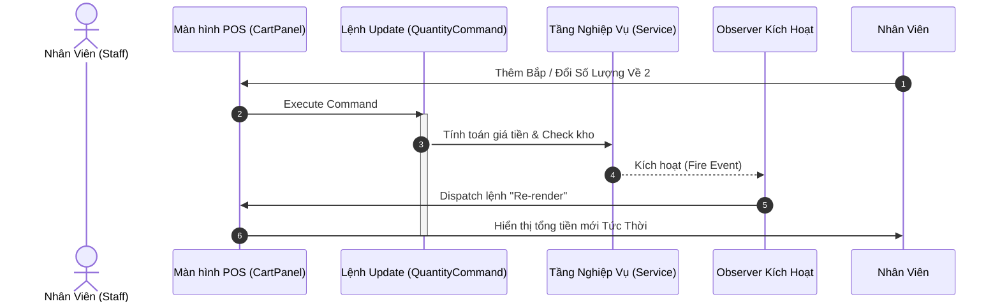
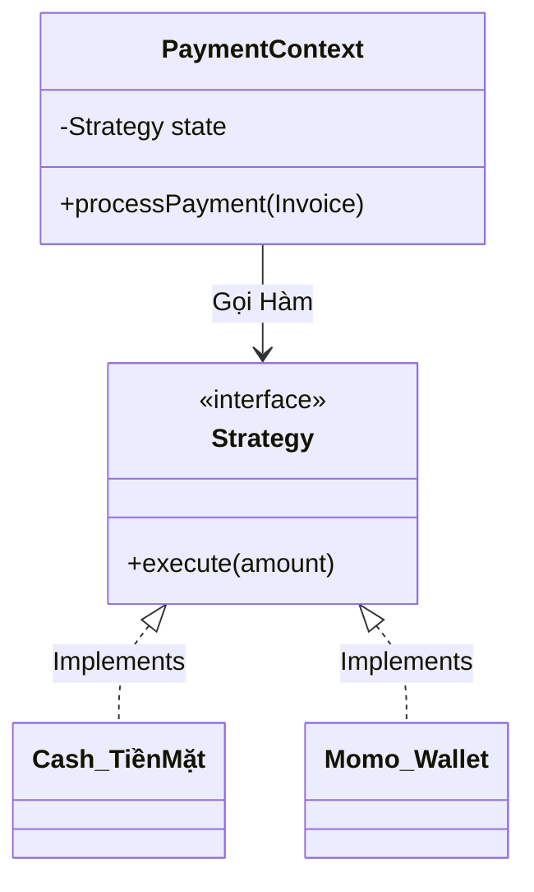
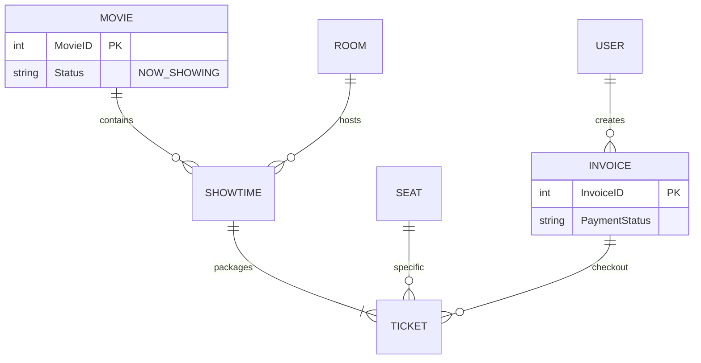

<div align="center">

<p align="center">
  <a href="#">
    
  </a>
</p>

<h1 style="font-family: 'Segoe UI', Helvetica, Arial, sans-serif; font-weight: 800; font-size: 2.8em; margin-bottom: 0;">🎬 F3 CINEMA</h1>
<h3 style="font-family: 'Courier New', Courier, monospace; font-weight: 400; color: #888;">Nền Tảng Quản Lý Rạp Chiếu Phim Thế Hệ Mới</h3>

<a href="https://git.io/typing-svg">
  
</a>

<p align="center" style="font-family: system-ui, -apple-system, sans-serif;">
  
  
  
  
  
</p>

<p style="font-family: 'Helvetica Neue', Arial, sans-serif; font-size: 1.1em; color: #555; max-width: 800px; margin: 0 auto;">
  F3 Cinema là hệ thống phần mềm Desktop toàn diện được phát triển bằng <b>Java 21</b> kết hợp kiến trúc MVC và giao diện Dark-mode ấn tượng. Hệ thống tối ưu hóa toàn bộ chuỗi quy trình vận hành rạp chiếu phim từ khâu: <i>Nhập kho ➔ Lập lịch chiếu ➔ Bán vé/POS ➔ Báo cáo doanh thu</i>.
</p>

</div>

---

<details open>
  <summary style="font-family: 'Impact', sans-serif; font-size: 1.2em; cursor: pointer;"><b>📑 NỘI DUNG (TABLE OF CONTENTS)</b></summary>
  <ul style="font-family: 'Inter', sans-serif;">
    <li><a href="#-tính-năng-cốt-lõi-core-features">Tính Năng Cốt Lõi</a></li>
    <li><a href="#-kiến-trúc--design-patterns-architecture">Kiến Trúc & Design Patterns</a>
      <ul>
        <li><a href="#1-point-of-sale-pos--giỏ-hàng-command--observer">Point of Sale (Command / Observer)</a></li>
        <li><a href="#2-hệ-thống-thanh-toán-strategy-pattern">Hệ thống Thanh toán (Strategy)</a></li>
      </ul>
    </li>
    <li><a href="#-cấu-trúc-dữ-liệu-erd">Cấu Trúc Dữ Liệu (ERD)</a></li>
    <li><a href="#-bắt-đầu-nhanh-getting-started">Bắt Đầu Nhanh (Getting Started)</a></li>
    <li><a href="#-đội-ngũ-phát-triển">Đội Ngũ Phát Triển</a></li>
  </ul>
</details>

---

<h2 id="-tính-năng-cốt-lõi-core-features" style="font-family: 'Arial Black', sans-serif;">✨ Tính Năng Cốt Lõi (Core Features)</h2>

Dự án được phân rã thành **2 Trạm Hoạt Động (Workstations)** tách biệt nhằm tối đa hóa hiệu suất sử dụng tại Rạp.

### 👑 Trạm Quản Trị (Admin Portal)
*Được thiết kế hướng dữ liệu (Data-driven) và kiểm soát toàn cục.*
- **Quản lý rạp & Lịch chiếu:** Thiết lập rạp, cấu hình Layout ghế (VIP, Couple, Standard) và gán suất chiếu với cơ chế chống trùng giờ (Conflict validation).
- **Warehouse (Kho Hàng):** Tracking chính xác số lượng hàng tồn kho (Nước, Bắp), khởi tạo phiếu nhập (`StockReceipt`).
- **Thống kê Doanh Thu (Dashboard):** Visualize dữ liệu kinh doanh thông qua biểu đồ **JFreeChart** sắc nét. Tự động tính toán các chỉ số Sale theo thời gian.

### 💳 Quầy Bán Vé (Staff POS System)
*Được thiết kế tối giản, tập trung vào tốc độ xử lý ngầm.*
- **Real-time Map:** Màn hình Booking trực quan hiển thị ma trận ghế ngồi (Matrix). Tự động khóa các vị trí đã có người đặt.
- **Cart System:** Terminal mua Bắp/Nước linh động, hiển thị `Total` tức thời ngay khi thay đổi số lượng.
- **Invoice Generator:** Tự động in và xuất hóa đơn PDF tiêu chuẩn bằng **OpenPDF** gửi cho khách.

---

<h2 id="-kiến-trúc--design-patterns-architecture" style="font-family: 'Arial Black', sans-serif;">📐 Kiến Trúc & Design Patterns (Architecture)</h2>

Mã nguồn được cấu trúc chặt chẽ theo tư tưởng **Clean Code** nhằm dễ bảo trì và dễ mở rộng các tính năng mới trong tương lai.

### 1. Point of Sale (POS) & Giỏ Hàng (Command / Observer)
Luồng mua hàng của khách ở quầy tuyệt đối không được xảy ra lỗi đồng bộ UI.



### 2. Hệ Thống Thanh Toán (Strategy Pattern)
Tương lai rạp chiếu phim có thể cần liên kết hàng chục cổng thanh toán (Visa, Apple Pay...). Kiến trúc `Strategy` được đặt ra nhằm dễ dàng `plug-and-play` mã mới.



---

<h2 id="-cấu-trúc-dữ-liệu-erd" style="font-family: 'Arial Black', sans-serif;">🗄️ Cấu Trúc Dữ Liệu (ERD)</h2>

Tổ chức Database đạt chuẩn, quản lý qua **Hibernate ORM framework**. Chuyển đổi toàn bộ Query truyền thống sang Object-Relational Mapping.



---

<h2 id="-bắt-đầu-nhanh-getting-started" style="font-family: 'Arial Black', sans-serif;">🚀 Bắt Đầu Nhanh (Getting Started)</h2>

Dự án đã được tự động hóa hoàn toàn luồng setup Database thông qua Container, loại bỏ nỗi lo cài đặt CSDL rườm rà.

### Yêu Cầu Môi Trường (Prerequisites)
- [Java Development Kit 21 LTS](https://jdk.java.net/21/)
- [Apache Maven 3.9+](https://maven.apache.org/)
- [Docker Engine](https://www.docker.com/) (Dành cho Database)

### Các Bước Cài Đặt (Installation)

**1. Pull & Khởi động Database (Bắt buộc)**
Chạy script docker-compose để mount volume MySQL và Inject dữ liệu mẫu (Sample Data) từ `init.sql`:
```bash
docker-compose up -d
```

**2. Biên Dịch Dự Án (Build)**
```bash
mvn clean compile
```

**3. Kích Hoạt Ứng Dụng (Run)**
```bash
mvn exec:java -Dexec.mainClass="com.f3cinema.app.App"
```

### 🔑 Thông Số Vận Hành (Sandbox Credentials)
> Để đăng nhập vào hệ thống, sử dụng tài khoản mẫu đại diện cho 2 hệ thống chính:

| Chức Vụ (Role) | Tài Khoản Đăng Nhập | Mật Khẩu Truy Cập | Khả năng |
| :--- | :--- | :--- | :--- |
| **Quản Lý Vận Hành (Admin)** | <kbd>admin</kbd> | <kbd>admin123</kbd> | Toàn quyền kiểm soát rạp |
| **Giao Dịch Viên (Staff POS)** | <kbd>staff</kbd> | <kbd>staff123</kbd> | Quầy bán vé và đồ ăn |

---

<h2 id="-đội-ngũ-phát-triển" style="font-family: 'Arial Black', sans-serif;">🤝 Đội Ngũ Phát Triển</h2>

Dự án **F3 Cinema Management System** được định hình, thiết kế và nhào nặn dưới bàn tay của bộ 3 nhà sáng lập kiêm kỹ sư phần mềm (**F3 Team**). 

Đây không chỉ là một ứng dụng quản trị thông thường, mà là một sản phẩm thể hiện sự dung hòa giữa cấu trúc thuật toán nghiêm ngặt và tính nghệ thuật của điện ảnh.  

<br/>

<div align="center">
  <sub>Mã nguồn mở phục vụ cho mục đích học thuật và vận hành phi thương mại.</sub><br/>
  
</div>
