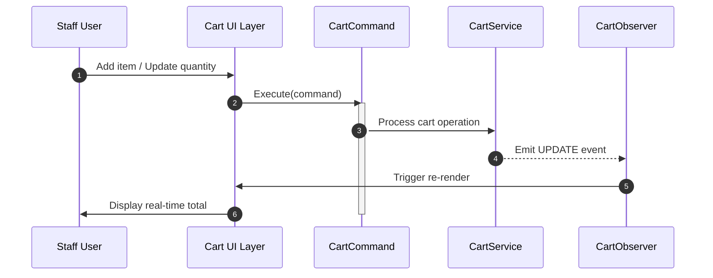
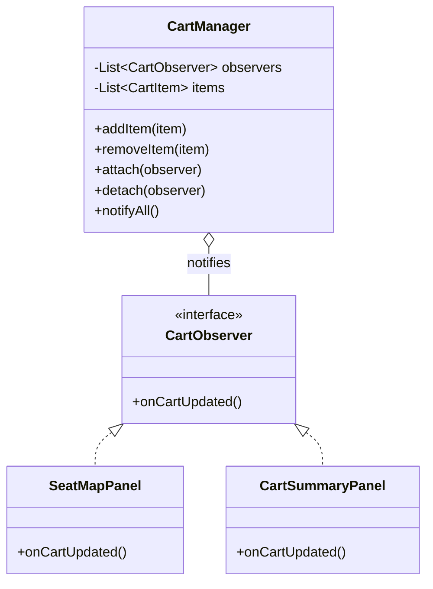
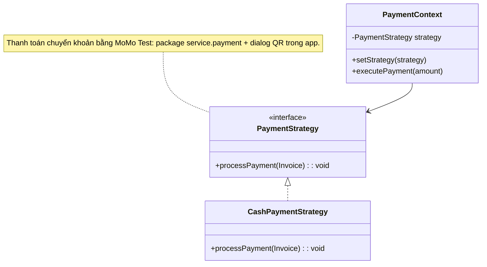
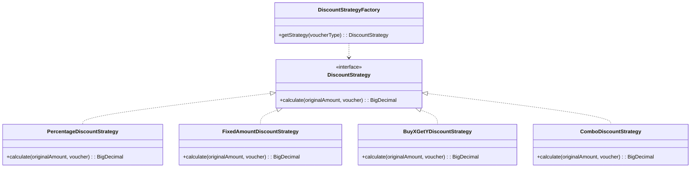
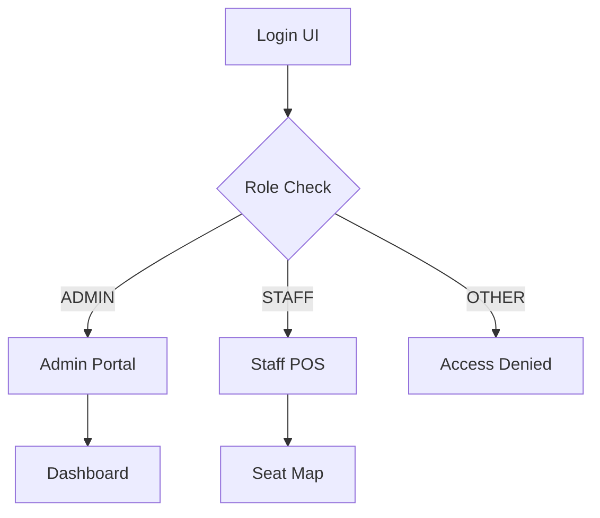

<div align="center">

[](https://github.com/f3-cinema)

<br/>

[](https://jdk.java.net/21/)
[](https://hibernate.org/)
[](https://www.mysql.com/)
[](https://www.formdev.com/flatlaf/)
[](https://www.docker.com/)
[](https://maven.apache.org/)

[](https://git.io/typing-svg)

<p align="center" style="margin-top: 20px;">
  <b>🎬 Next-Generation Cinema Management Platform</b><br/>
  <sub>Built with Java 21 LTS • Hibernate 6.6.1 • MySQL 8.4 • FlatLaf Modern UI</sub>
</p>

</div>

---

<details align="center">
  <summary style="cursor: pointer; color: #6366F1; font-weight: 600; padding: 12px; border-radius: 8px; background: rgba(99, 102, 241, 0.1); display: inline-block;">
    📑 Table of Contents
  </summary>
  <ul style="list-style: none; padding: 20px; text-align: left; display: inline-block;">
    <li><a href="#about">About</a></li>
    <li><a href="#features">Key Features</a></li>
    <li><a href="#tech-stack">Tech Stack</a></li>
    <li><a href="#architecture">Architecture & Patterns</a></li>
    <li><a href="#database">Database Schema</a></li>
    <li><a href="#project-structure">Project Structure</a></li>
    <li><a href="#installation">Installation & Setup</a></li>
    <li><a href="#quick-start">Quick Start</a></li>
    <li><a href="#troubleshooting">Troubleshooting</a></li>
    <li><a href="#contributors">Contributors</a></li>
  </ul>
</details>

---

## About

**F3 Cinema Management** is a comprehensive enterprise desktop application designed for cinema chain operations. Built with Java 21 LTS and modern Swing UI via FlatLaf, it delivers a polished Midnight-themed experience with real-time seat mapping, integrated POS, inventory management, customer loyalty system, and powerful analytics dashboards.

The system is architected around **MVC pattern** with **Hibernate ORM** for clean database abstraction, featuring industry-standard design patterns including **Command**, **Observer**, **Strategy** (Payment & Discount), and **Factory** for maintainable, scalable code.

---

## Key Features

<div align="center">

| # | Feature | Description |
|---|---------|-------------|
| **01** | 🎬 **Movie & Showtime Management** | Full movie lifecycle (Coming Soon → Now Showing → Ended), smart scheduling with conflict detection, genre management |
| **02** | 💺 **Real-Time Seat Mapping** | Interactive seat matrix UI with live availability, VIP/Sweetbox seat configuration per theater |
| **03** | 🛒 **POS & Integrated Cart** | Seamless flow: Select Seats → Add Snacks → Apply Voucher → Payment in single screen |
| **04** | 📄 **Invoice Generation** | Auto-generate professional PDF invoices via OpenPDF library with detailed breakdown |
| **05** | 📦 **Inventory Management** | Stock tracking for concessions (popcorn, beverages), auto-alert for low inventory, import receipts |
| **06** | 🎟️ **Voucher System** | 4 discount types: Percentage, Fixed Amount, Buy X Get Y, Combo Discount with usage limits |
| **07** | 👥 **Customer & Loyalty** | Walk-in + registered customers, loyalty points accumulation, tier-based benefits |
| **08** | 🏠 **Room & Seat Configuration** | Theater layouts (2D/IMAX), dynamic seat types (NORMAL/VIP/SWEETBOX) |
| **09** | 📊 **Dashboard & Statistics** | JFreeChart-powered financial reports, revenue analytics, top movies, inventory alerts |
| **10** | 📜 **Transaction History** | Search & filter transactions, export records, payment status tracking |

</div>

---

## Tech Stack

<div align="center">

| Technology | Description |
|------------|-------------|
|  | Core language |
|  | ORM & persistence |
|  | Primary database |
|  | Modern UI theming |
|  | Build automation |
|  | Container deployment |

### Core Dependencies

| Library | Version | Purpose |
|---------|---------|---------|
| HikariCP | 5.1.0 | High-performance connection pooling |
| Lombok | 1.18.34 | Code generation (getters/setters/builders) |
| BCrypt | 0.10.2 | Secure password hashing |
| JFreeChart | 1.5.5 | Data visualization & charts |
| OpenPDF | 2.0.3 | PDF document generation |
| Log4j2 | 2.24.1 | Enterprise logging framework |

</div>

---

## Architecture & Design Patterns

### System Overview

```
┌─────────────────────────────────────────────────────────────────────┐
│                        PRESENTATION LAYER                          │
│  ┌─────────────────┐              ┌─────────────────────────────┐  │
│  │  Admin Portal   │              │      Staff POS Terminal      │  │
│  │  (Dashboard)     │              │   (Seat Map + Cart + POS)   │  │
│  └────────┬────────┘              └──────────────┬──────────────┘  │
└───────────┼───────────────────────────────────────┼──────────────────┘
            │                                       │
            ▼                                       ▼
┌─────────────────────────────────────────────────────────────────────┐
│                        BUSINESS LAYER (Service)                    │
│  ┌──────────────┐  ┌──────────────┐  ┌──────────────┐              │
│  │   Command    │  │   Observer   │  │   Strategy   │              │
│  │   Pattern    │  │   Pattern    │  │   Pattern    │              │
│  │  (Cart Ops)  │  │  (Cart UI)   │  │ (Payment)    │              │
│  └──────────────┘  └──────────────┘  └──────────────┘              │
│                                                                    │
│  ┌──────────────┐  ┌──────────────┐                                │
│  │   Strategy   │  │   Factory    │                                │
│  │   Pattern    │  │   Pattern    │                                │
│  │ (Discount)   │  │ (Strategy)   │                                │
│  └──────────────┘  └──────────────┘                                │
└─────────────────────────────────────────────────────────────────────┘
            │
            ▼
┌─────────────────────────────────────────────────────────────────────┐
│                      DATA ACCESS LAYER (Repository)                 │
│  ┌──────────────────────────────────────────────────────────────┐   │
│  │              Hibernate ORM + HikariCP Connection Pool         │   │
│  └──────────────────────────────────────────────────────────────┘   │
            │
            ▼
┌─────────────────────────────────────────────────────────────────────┐
│                         DATABASE (MySQL 8.4)                      │
└─────────────────────────────────────────────────────────────────────┘
```

### 1. Command Pattern — Cart Operations



**Implementation:**
- `AddToCartCommand` — Add product/seat to cart
- `RemoveFromCartCommand` — Remove item from cart
- `UpdateQuantityCommand` — Change item quantity
- `ClearCartCommand` — Empty entire cart

### 2. Observer Pattern — Real-Time Cart Updates



### 3. Strategy Pattern — Payment Gateway



### 4. Strategy + Factory Pattern — Discount System



---

## Database Schema

| Table | Description | Key Columns |
|-------|-------------|-------------|
| `users` | Admin/Staff accounts | id, username, password_hash, role, full_name |
| `customers` | Walk-in + registered customers | id, full_name, phone, points |
| `movies` | Movie info | id, title, duration, status, poster_url |
| `genres` | Movie genres | id, name |
| `movie_genres` | Movie-Genre mapping | movie_id, genre_id |
| `rooms` | Theater rooms | id, name, type (2D/IMAX) |
| `seats` | Seats per room | id, room_id, row_char, number, type (NORMAL/VIP/SWEETBOX) |
| `showtimes` | Show schedules | id, movie_id, room_id, start_time, end_time, base_price |
| `products` | Snacks/drinks | id, name, price, unit, image_url |
| `inventories` | Stock tracking | product_id, current_quantity, min_threshold |
| `stock_receipts` | Import orders | id, receipt_date, supplier, total_import_cost |
| `stock_receipt_items` | Import items | id, receipt_id, product_id, quantity, import_price |
| `promotions` | Discount campaigns | id, code, discount_percent |
| `vouchers` | Voucher codes | id, code, voucher_type, discount_percent/amount, usage_limit |
| `invoices` | Sales transactions | id, user_id, customer_id, promotion_id, status, final_total |
| `invoice_items` | Product line items | id, invoice_id, product_id, quantity, unit_price |
| `payments` | Payment records | id, invoice_id, amount, method, status, transaction_id (mã tham chiếu chuyển khoản) |

---

## Project Structure

```
f3-cinema-management/
├── src/main/
│   ├── java/com/f3cinema/app/
│   │   ├── config/
│   │   │   ├── HibernateUtil.java        # JPA/Hibernate configuration
│   │   │   └── ThemeConfig.java           # FlatLaf theming setup
│   │   ├── controller/                   # UI controllers
│   │   ├── dto/                          # Data Transfer Objects (Records)
│   │   │   ├── dashboard/                # Dashboard-specific DTOs
│   │   │   ├── transaction/             # Transaction DTOs
│   │   │   └── customer/                # Customer DTOs
│   │   ├── entity/                      # JPA Entities
│   │   │   └── enums/                   # Enum types (MovieStatus, UserRole, etc.)
│   │   ├── exception/                   # Custom exceptions
│   │   │   ├── CinemaException.java
│   │   │   └── AuthenticationException.java
│   │   ├── repository/                  # Data Access Layer
│   │   ├── service/                     # Business Logic Layer
│   │   │   ├── cart/                    # Cart (Command + Observer Patterns)
│   │   │   │   ├── CartManager.java
│   │   │   │   ├── CartObserver.java
│   │   │   │   └── command/
│   │   │   │       ├── CartCommand.java
│   │   │   │       ├── AddToCartCommand.java
│   │   │   │       ├── RemoveFromCartCommand.java
│   │   │   │       ├── UpdateQuantityCommand.java
│   │   │   │       └── ClearCartCommand.java
│   │   │   ├── payment/                 # Payment (Strategy Pattern)
│   │   │   │   ├── PaymentStrategy.java
│   │   │   │   ├── PaymentContext.java
│   │   │   │   ├── CashPaymentStrategy.java
│   │   │   │   └── MomoPaymentService.java
│   │   │   ├── discount/                # Discount (Strategy + Factory Patterns)
│   │   │   │   ├── DiscountStrategy.java
│   │   │   │   ├── DiscountStrategyFactory.java
│   │   │   │   ├── PercentageDiscountStrategy.java
│   │   │   │   ├── FixedAmountDiscountStrategy.java
│   │   │   │   ├── BuyXGetYDiscountStrategy.java
│   │   │   │   └── ComboDiscountStrategy.java
│   │   │   └── impl/                    # Service implementations
│   │   ├── ui/                          # Swing UI Layer
│   │   │   ├── admin/                   # Admin interface
│   │   │   ├── dashboard/               # Shared dashboard components
│   │   │   ├── staff/                   # Staff POS interface
│   │   │   └── components/              # Reusable UI components
│   │   └── util/                        # Utilities & helpers
│   └── resources/
│       ├── sql/
│       │   └── init.sql                 # Database initialization (17 tables)
│       └── log4j2.xml                   # Logging configuration
├── target/                              # Build output
├── docker-compose.yml                   # MySQL container setup
├── pom.xml                             # Maven configuration
└── README.md                           # This file
```

---

## Installation & Setup

### Prerequisites

| Requirement | Version | Download |
|-------------|---------|----------|
| **Java JDK** | 21 LTS | [Oracle JDK](https://jdk.java.net/21/) or [Amazon Corretto](https://aws.amazon.com/corretto/) |
| **Maven** | 3.9+ | [Maven.apache.org](https://maven.apache.org/download.cgi) |
| **Docker** | Latest | [Docker Desktop](https://www.docker.com/products/docker-desktop) |

### Step 1: Start Database (Docker)

```bash
# Start MySQL 8.4 container with auto-initialization
docker-compose up -d

# Verify container is running
docker ps | grep f3_cinema
```

### Step 2: Build Project

```bash
# Clean and compile the project
mvn clean compile

# (Optional) Package as JAR
mvn package
```

### Step 3: Run Application

```bash
# Execute main class
mvn exec:java -Dexec.mainClass="com.f3cinema.app.App"
```

### Chuyển khoản MoMo Test

Cấu hình tài khoản nhận tiền trong `src/main/resources/momo.properties` (hoặc dùng `momo.properties.example`). Ở bước thanh toán, hệ thống hiển thị QR MoMo Test ngay trong app và thu ngân xác nhận "Đã nhận tiền" để chốt đơn.

---

## Quick Start

### Default Login Credentials

| Role | Username | Password | Access Level |
|------|----------|----------|--------------|
| **Admin** | `admin` | `1` | Full system access (Dashboard, Movies, Rooms, Inventory, Reports, Vouchers) |
| **Staff** | `staff` | `1` | POS terminal (Seat selection, Cart, Checkout, Customer lookup) |

> **Note:** Password is hashed with BCrypt. Default hash: `$2a$12$eUnQAUgU6wG1akE0xbsAYOkKsx.joNW1QHah.6A7fO7suIDtAnA76`

### First Launch Flow



---

## Troubleshooting

### Common Issues & Solutions

| Issue | Cause | Solution |
|-------|-------|----------|
| **Lombok not generating getters/setters** | Annotation processor not run | Run `mvn clean compile` to force re-generation |
| **Database connection failed** | MySQL container not ready | Wait 10-15s after `docker-compose up`, or check logs: `docker logs f3_cinema_db` |
| **Font display issues** | Missing system fonts | App uses `-apple-system` fallback; no action needed |
| **Empty database after restart** | Docker volume not persisted | Use `docker-compose down -v` to wipe volumes, then restart |
| **Port 3306 already in use** | Another MySQL instance running | Stop local MySQL or change port in `docker-compose.yml` |

### Reset Database

```bash
# Complete reset (removes all data)
docker-compose down -v
docker-compose up -d

# Re-initialize if needed
docker exec -i f3_cinema_db mysql -uroot -p123456 f3_cinema < src/main/resources/sql/init.sql
```

### View Application Logs

```bash
# Application logs (Log4j2)
# Check console output when running with -Dexec.outputLogging=always
```

---

## Contributors

<div align="center">


<br/>

**CoffatDev** &nbsp;&nbsp;•&nbsp;&nbsp; **taidangdev** &nbsp;&nbsp;•&nbsp;&nbsp; **Nhat Huy**

<br/>


<br/>

[](LICENSE)
[](https://github.com/f3-cinema)

</div>

---

<div align="center">

*This README was generated for F3 Cinema Management System v1.0.0*

</div>